# Practica 9

Los diagramas de control de flujo estan realizados con [mermaid](https://docs.mermaidchart.com/mermaid-oss/syntax/flowchart.html).

## Ejercicio 1

### Codigo:

```python
def max (x: int, y: int ) -> int:
L1:  result: int = 0
L2:  if x < y:
L3:     result = y
     else:
L4:     result = x
L5:  return result
```

- test1:
    - Entrada x = 0, y=0
    - Resultado esperado result=0
- test2:
    - Entrada x = 0, y=1
    - Resultado esperado result=1


### Diagrama de control de flujo:

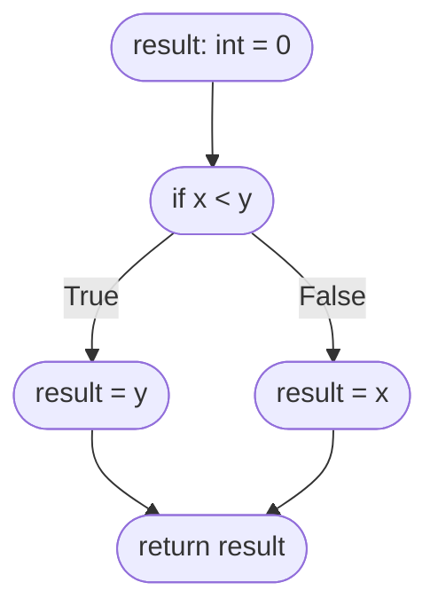

### Lineas del programa que cubre cada test:

| Test | L1 | L2 | L3 | L4 | L5 |
|---|---|---|---|---|---|
|test1|X|X||X|X|
|test2|X|X|X||X|

### Decisiones (branches) que cubre cada test:

| Test | L2-True | L2-False |
|---|---|---|
|test1||X|
|test2|X||

El test suite compuesto por *test1* y *test2* cubre el 100% de las lineas del programa y el 100% de las decisiones (branches). Esto lo podemos ver a partir de las tablas anteriores:

$$ cobertura nodos = \frac{cantidad nodos ejercitados}{cantidad nodos} = \frac{5}{5} $$

$$ cobertura branches = \frac{cantidad decisiones ejercitadas}{cantidad decisiones} = \frac{2}{2} $$

Lo que hay que tener en cuenta y ser conciente de que, a pesar de estos porcentajes prometedores, no existe un test para cuando $x$ sea el maximo. Entonces, la cobertura (coverage) no asegura que los test sean *buenos*.

## Ejercicio 2

### Diagrama de control de flujo

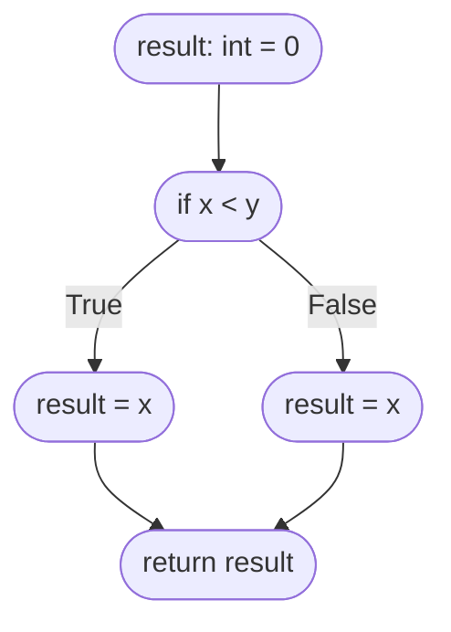

### Test suite

- minA:
    - Entrada x=0,y=1
    - Salida esperada 0
- minB:
    - Entrada x=1,y=1
    - Salida esperada 1

La ejecucion del test suite resulta en la ejecucion de todas las lineas y decisiones (branches) del programa. Sin embargo, este test suite no es capaz de detectar el defecto de la implementacion del programa. Habria que, por ejemplo, agregar un test case mas, como este:

- minC:
    - Entrada x=1,y=0
    - Salida esperada 0

De esta forma, con la implementacion actual, este caso de prueba $minC$ fallaria, y nos dariamos cuenta del error en la implementacion.

## Ejercicio 3

### Diagrama de control de flujo (control-flow graph)

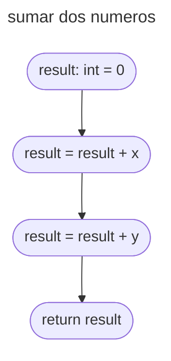

### Test Suite

- sumaA:
    - Entrada x=1,y=2
    - Salida esperada 3

Teoricamente con este unico caso de prueba ya cubro todos los nodos y arcos. O me falta considerar algo?

## Ejercicio 4

### Diagrama de control de flujo (control-flow graph)

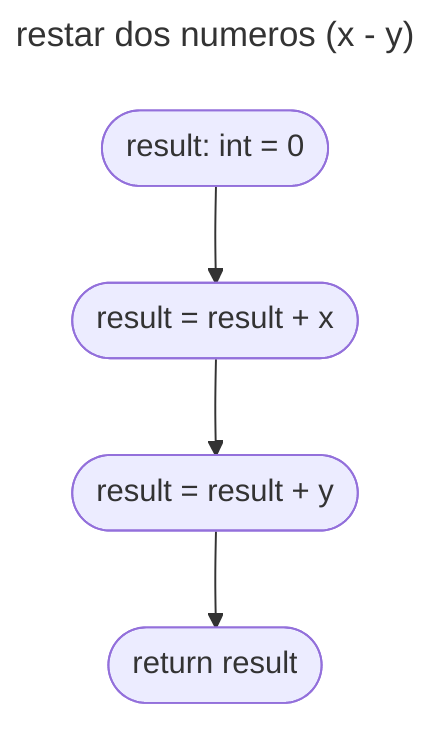

### Test Suite

- restaA:
    - Entrada x=1,y=0
    - Salida esperada 1

Este test suite ejecuta todas las lineas del codigo. Sin embargo, este test suite no detecta el defecto en la implementacion. Podemos agregar un caso mas para detectarlo:

- restaB:
    - Entrada x=1,y=2
    - Salida esperada -1

## Ejercicio 5

### Codigo

```python
def signo(x: float) -> int:
    result : int = 0
    if x < 0:
        result = -1
    elif x > 0:
        result = 1
    return result
```

### Diagrama de control de flujo

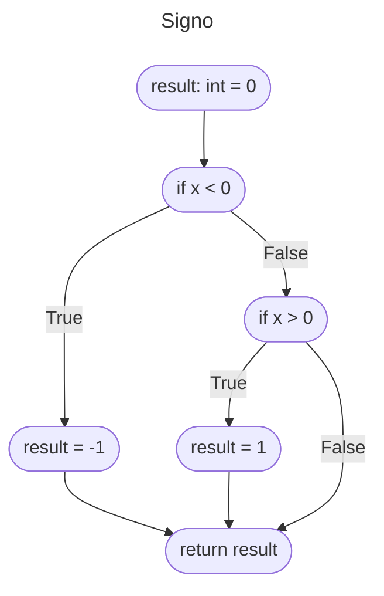

### Test suite

- signoA:
    - Entrada x=5
    - Salida esperada 1
- signoB:
    - Entrada x=-5
    - Salida esperada -1

El test suite con signoA y signoB ejecuta todas las lineas del programa, pero no ejecuta todas las posibles decisiones. Queda sin cubrir el False de $x>0$. Agregamos un test mas:

- signoC:
    - Entrada x=0
    - Salida esperada 0

## Ejercicio 6

### Codigo del programa

```python
def fabs(x: float) -> float:
    result :float = 0
    if x < 0:
        result = -x
    return result
```

### Diagrama de control de flujo (control-flow graph, o CFG)

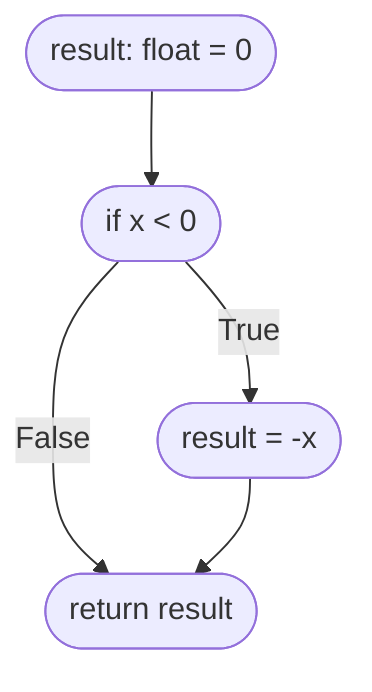

### Test suite

#### Ejecuta todas las lineas (pero no todas las decisiones)

- fabsA:
    - Entrada x=-3
    - Salida esperada 3

#### Ejecuta todas las decisiones (no detecta el bug)

- fabsA:
    - Entrada x=-3
    - Salida esperada 3

- fabsB:
    - Entrada x=0
    - Salida esperada 0

#### Para detectar el bug

- fabsA:
    - Entrada x=-3
    - Salida esperada 3

- fabsB:
    - Entrada x=0
    - Salida esperada 0

- fabsC:
    - Entrada x=3
    - Salida esperada 3

## Ejercicio 7

### Codigo del programa

```python
def fabs(x: float) -> float:
    if x < 0:
        return -x
    else:
        return x
```

### Control-Flow Graph

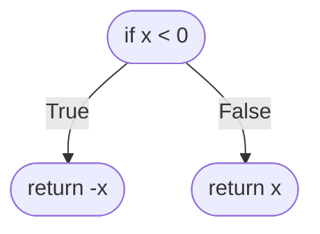

### Test suite (ejecuta todas las lineas y todas las branches del programa)

- fabsA:
    - Entrada: x=-3
    - Salida esperada: 3

- fabsB:
    - Entrada: x=3
    - Salida esperada: 3

## Ejercicio 8

### Codigo

```python
def mult10(x: int ) -> int:
    result: int = 0
    count: int = 0
    while(count < 10):
        result = result + x
        count = count + 1
    return result
```

### Control-Flow Graph

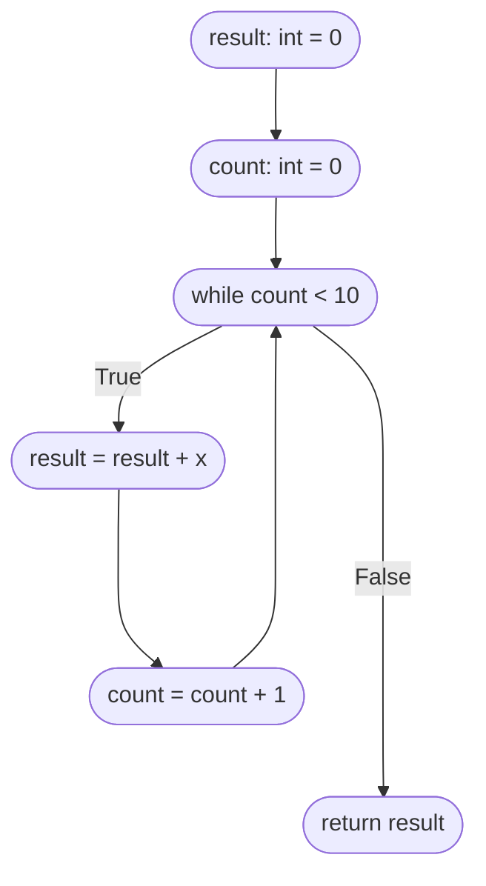

### Test suite

- mul10A:
    - Entrada: x = 5
    - Salida esperada: 50

Este test suite ejecuta todas las lineas del programa, y tambien todas las decisiones (branches), ya que el while primero va a ser True, y al terminar de contar 10 veces queda en False.

## Ejercicio 9

### Codigo

```python
def sumar ( x : int , y : int ) -> int :
    sumando : int = 0
    abs_y : int = 0
    if y < 0:
        sumando = -1
        abs_y = -y
    else :
        sumando = 1
        abs_y = y
    result : int = x
    count : int = 0
    while ( count < abs_y ):
        result = result + sumando
        count = count + 1
    return result
```

### Control-Flow Graph

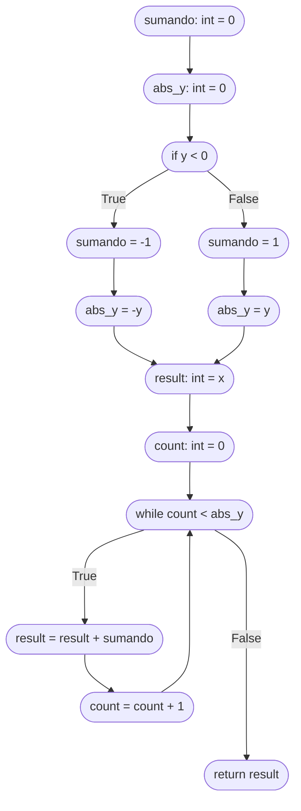

### Test suite

- sumaA:
    - Entrada: x=2,y=3
    - Salida esperada: 5

- sumaB:
    - Entrada: x=2,y=-3
    - Salida esperada: -1

## Ejercicio 10

### Programa

```python
def mcd ( x : int , y : int ) -> int :
    # requiere : x e y tienen que ser no negativos
    tmp : int = 0
    while ( y != 0):
        tmp = x % y
        x = y
        y = tmp
    return x
```

### Diagrama

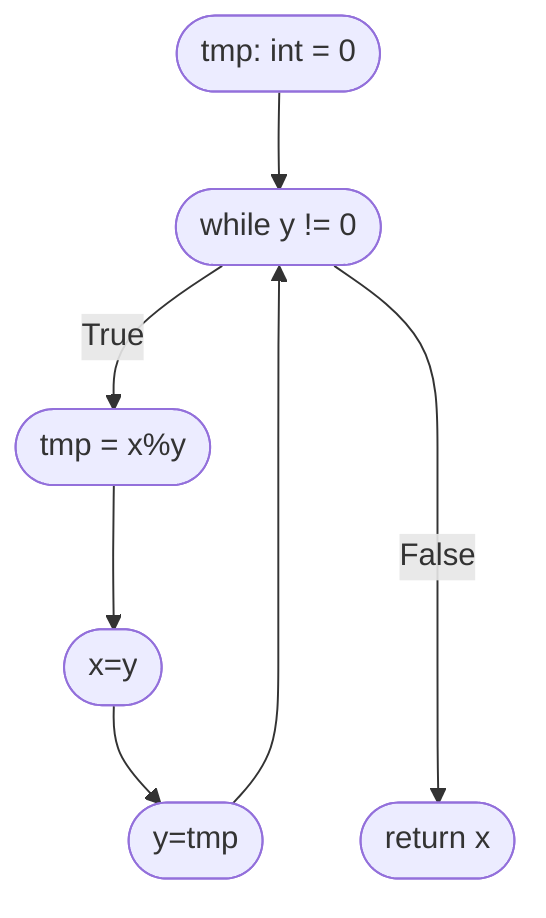

### Test Suite

- mcdA:
    - Entrada: x=3,y=5
    - Salida esperada: 15

## Ejercicio 11

### Codigo

```python
def triangle ( a : int , b : int , c : int ) -> int :
    if( a <= 0 or b <= 0 or c <= 0):
        return 4 # invalido
    if( not (( a + b > c ) and ( a + c > b ) and ( b + c > a ))):
        return 4 # invalido
    if( a == b and b == c ):
        return 1 # equilatero
    if( a == b or b == c or a == c ):
        return 2 # isosceles
    return 3 # escaleno
```

### Diagrama

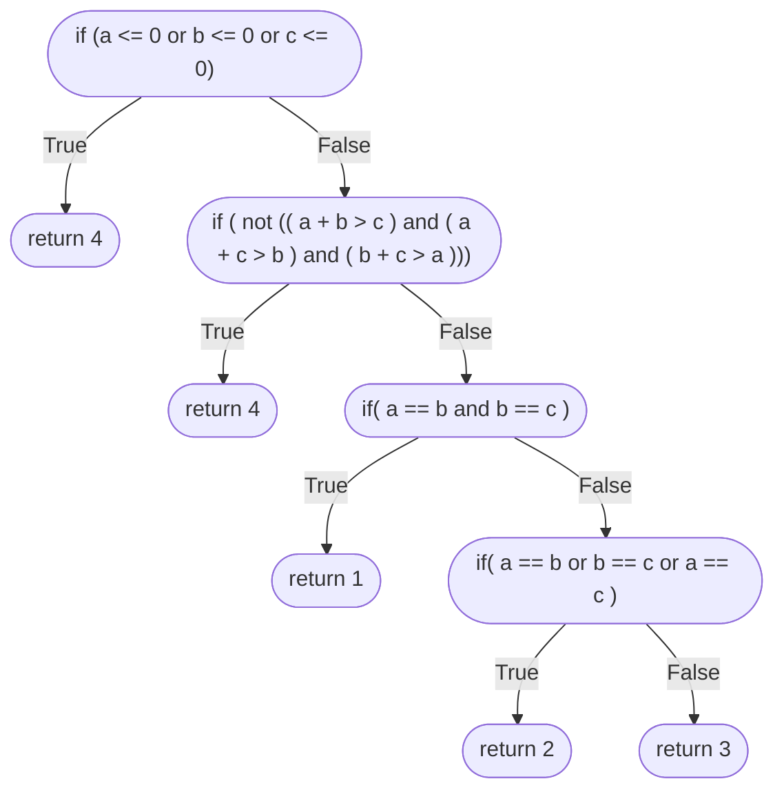

### Test Suite

- triangleA:
    - Entrada: a=-1,b=1,c=1
    - Salida esperada: 4

- triangleB:
    - Entrada: a=1,b=2,c=4
    - Salida esperada: 4

- triangleC:
    - Entrada: a=2,b=2,c=2
    - Salida esperada: 1

- triangleD:
    - Entrada: a=3,b=3,c=2
    - Salida esperada: 2

- triangleE:
    - Entrada: a=3,b=4,c=5
    - Salida esperada: 3

## Ejercicio 12

### Codigo

```python
def multByAbs ( x : int , y : int ) -> int :
    abs_y : int = fabs ( y ) # ejercicio anterior
    if abs_y < 0:
        return -1
    else :
        result : int = 0
        i : int = 0
        while i < abs_y :
            result = result + x 
            i += 1
    return result
```

### Diagrama

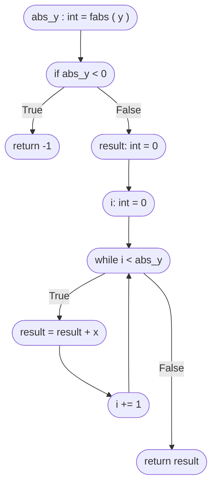

La linea L3 nunca se va a ejecutar, porque fabs da un numero mayor o igual a 0. La branch True del primer if no se cumple nunca por el mismo motivo.

### Test Suite

- multByAbsA:
    - Entrada: x=2,y=-3
    - Salida Esperada: 6

## Ejercicio 13

### Codigo

```python
def vaciarSecuencia ( s : list[int ]):
    for i in range(len(s)):
        s[i] = 0
```

### Diagrama de Control de Flujo (Control-Flow Graph)

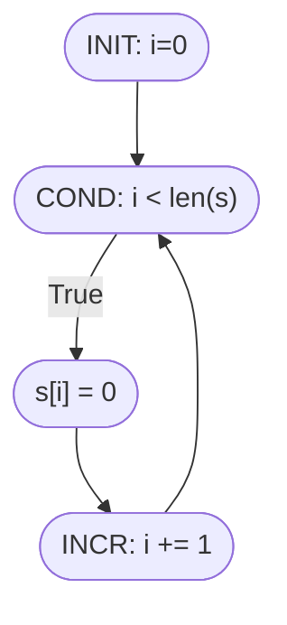

### Test Suite

- vaciarSecuenciaA
    - Entrada: s=[1,2,3]
    - Salida Esperada: s=[0,0,0]

## Ejercicio 14

### Codigo

```python
def existeElemento ( s : list[int ] , e : int ) -> bool :
    result : bool = False
    for i in range (len( s )):
        if s [ i ] == e :
            result = True
            break
    return result
```

### Diagrama

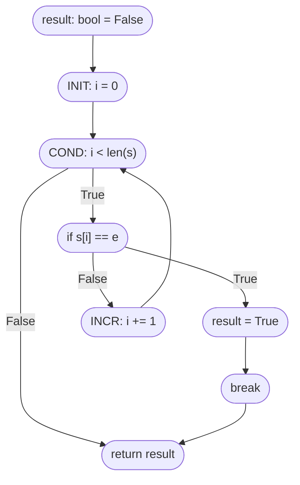

### Test Suite

- existeElementoA
    - Entrada: s=[1,2,3,4], e=2
    - Salida Esperada: True

- existeElementoB
    - Entrada: s=[1,2,3,4], e=4
    - Salida Esperada: True